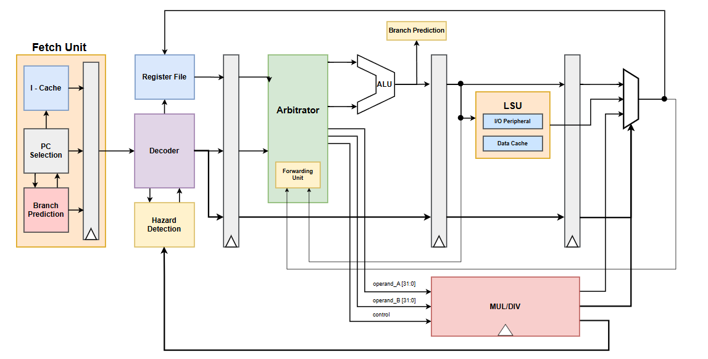

# RV32IM_core

This is a **RISC-V RV32IM processor core** currently under development by a student at **HCMUT**. The design is written in **SystemVerilog** and targets FPGA implementation. The core supports the **RV32IM** instruction set.

## Instruction Set Architecture
This processor implements the **RV32I base integer ISA**, with support extended to **RV32IM**. The RV32IM maintains the same architecture as RV32I but adds multiplication and division capabilities. You may find detailed ISA documentation below:
- 📄 [riscv32i_instruction_set.pdf](./riscv32i_instruction_set.pdf) – Core instruction definitions
- 📄 [riscv32i.pdf](./riscv32i.pdf) – ISA summary
- 📄 [RV32I_manual.pdf](./RV32I_manual.pdf) – Descriptive documentation of RV32I
- 📄 [riscv-card.pdf](./riscv-card.pdf) – Quick reference card for instruction formats and opcodes

## CPU Architecture Diagram

## FPGA Demonstration
You can watch the core in action, demonstrated on an FPGA board:
- 🔗 [RV32I FPGA Demonstration](https://drive.google.com/drive/folders/13oYjmAOKQ4ntwubS50nfFlonobGrE5KT?usp=sharing)
- 🔗 [M-extension FPGA Demonstration](https://drive.google.com/drive/folders/1CxTewY_Il2OmaQB1IkkPA-PhEx3SH5Fj?usp=sharing)

## RV32I Design Notes (Author's Guide)
If you're interested in how the **RV32I integer core was designed and implemented**, you can refer to this document written by the author.  
Since RV32IM is simply an extension of RV32I with the Multiply/Divide (`M`) instructions added, the architecture remains the same.
- 📄 [RV32I_Cookbook_Unfinished.pdf](./RV32I_Cookbook_Unfinished.pdf) – A detailed explanation of how the RV32I core is built and functions (Work in Progress)

## Folder Structure
- `00_src` — Core RTL source code (SystemVerilog)
- `01_tb` — Testbenches
- `02_sim` — Simulation scripts and outputs
- `03_quartus` — Quartus project files for FPGA synthesis
- `bcdtohex.sv` — Utility module for binary-to-display conversion
- `*.pdf` — Reference documents for instruction sets and RISC-V standards

## Note
This project is still under active development. More features and extensions may be added in the future.
---

